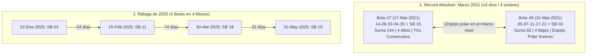

# 🎱 Análisis Estadístico, Numérico y Probabilístico: Botes Ganadores de Baloto

Este documento consolida el estudio analítico profundo de los **22 sorteos históricos donde cayó el premio mayor (acumulado 5+1)** en la modalidad principal de **Baloto** desde la adopción del formato actual (matriz 5 de 43 + Super Balota de 16), identificando patrones numéricos, coincidencias con el calendario, ráfagas de botes cercanos y su evaluación con el motor estocástico JAX.

---

## 📋 1. Registro Histórico de los 22 Botes Ganadores de Baloto (5+1)

| # | Fecha Sorteo | Balotas Principales | SB | Suma | Bajos / Altos | Pares / Impares | Premio Entregado (COP) |
| :-: | :---: | :---: | :-: | :-: | :---: | :---: | :---: |
| **1** | 2017-09-06 | `08 - 16 - 19 - 35 - 41` | **13** | 119 | 3B / 2A | 2P / 3I | $62.000.000.000 |
| **2** | 2018-05-05 | `05 - 06 - 14 - 26 - 31` | **11** | 82 | 3B / 2A | 3P / 2I | $46.000.000.000 |
| **3** | 2018-09-08 | `08 - 09 - 19 - 23 - 38` | **14** | 97 | 3B / 2A | 2P / 3I | $26.000.000.000 |
| **4** | 2019-11-13 | `08 - 11 - 13 - 18 - 27` | **12** | 77 | 4B / 1A | 2P / 3I | $69.500.000.000 |
| **5** | 2020-10-03 | `09 - 17 - 28 - 35 - 38` | **01** | 127 | 2B / 3A | 2P / 3I | $56.500.000.000 |
| **6** | 2020-11-21 | `06 - 18 - 34 - 40 - 43` | **16** | 141 | 2B / 3A | 4P / 1I | $13.000.000.000 |
| **7** | 2021-03-17 | `14 - 28 - 33 - 34 - 35` | **15** | 144 | 1B / 4A | 3P / 2I | $17.200.000.000 |
| **8** | 2021-03-31 | `05 - 07 - 11 - 17 - 22` | **03** | 62 | 4B / 1A | 1P / 4I | $8.000.000.000 |
| **9** | 2021-10-23 | `02 - 05 - 07 - 20 - 34` | **14** | 68 | 4B / 1A | 3P / 2I | $37.000.000.000 |
| **10** | 2022-08-13 | `05 - 06 - 18 - 19 - 24` | **09** | 72 | 4B / 1A | 3P / 2I | $46.000.000.000 |
| **11** | 2022-10-22 | `02 - 04 - 06 - 09 - 25` | **13** | 46 | 4B / 1A | 3P / 2I | $17.400.000.000 |
| **12** | 2023-03-11 | `09 - 13 - 15 - 27 - 31` | **15** | 95 | 3B / 2A | 0P / 5I | $20.000.000.000 |
| **13** | 2023-06-24 | `08 - 15 - 23 - 24 - 42` | **14** | 112 | 2B / 3A | 3P / 2I | $15.600.000.000 |
| **14** | 2023-10-25 | `15 - 22 - 25 - 28 - 33` | **07** | 123 | 1B / 4A | 2P / 3I | $16.000.000.000 |
| **15** | 2023-12-02 | `11 - 14 - 16 - 18 - 19` | **15** | 78 | 5B / 0A | 3P / 2I | $8.000.000.000 |
| **16** | 2024-03-06 | `19 - 25 - 26 - 39 - 41` | **15** | 150 | 1B / 4A | 1P / 4I | $14.600.000.000 |
| **17** | 2024-08-14 | `03 - 09 - 13 - 21 - 27` | **07** | 73 | 4B / 1A | 0P / 5I | $21.500.000.000 |
| **18** | 2025-01-22 | `12 - 15 - 28 - 34 - 37` | **01** | 126 | 2B / 3A | 3P / 2I | $29.000.000.000 |
| **19** | 2025-02-15 | `08 - 15 - 17 - 24 - 42` | **11** | 106 | 3B / 2A | 3P / 2I | $14.000.000.000 |
| **20** | 2025-04-30 | `05 - 12 - 17 - 19 - 22` | **16** | 75 | 4B / 1A | 2P / 3I | $140.000.000 |
| **21** | 2025-05-31 | `02 - 08 - 16 - 28 - 31` | **15** | 85 | 3B / 2A | 4P / 1I | $8.000.000.000 |
| **22** | 2025-11-08 | `10 - 12 - 23 - 31 - 37` | **10** | 113 | 2B / 3A | 2P / 3I | $290.000.000 |

---

## ⚡ 2. El Fenómeno de «Botes Gemelos» (Ganadores en Ráfaga)

Al igual que ocurrió en Revancha durante septiembre de 2026 (2 botes en 18 días), Baloto ha experimentado tres episodios extraordinarios de botes en ráfaga:

### Episodio A: Marzo de 2021 — El Récord de Espejo Polar en 14 Días
* **17 de Marzo de 2021:** Combinación cargada al extremo superior: `14 - 28 - 33 - 34 - 35` + SB `15`. 
  * Suma alta de **144**.
  * Trío consecutivo alto: **`33 - 34 - 35`**.
  * 4 Altos y solo 1 Bajo.
* **31 de Marzo de 2021 (14 días después):** Combinación cargada al extremo inferior: `05 - 07 - 11 - 17 - 22` + SB `03`.
  * Suma baja de **62**.
  * 4 Bajos y solo 1 Alto.
* **Fenómeno:** El péndulo estocástico osciló violentamente de un extremo superior a uno inferior en el mismo mes calendario.

### Episodio B: Primer Semestre de 2025 — La Mayor Racha Histórica
* En tan solo 4 meses (entre enero y mayo de 2025), el bote mayor de Baloto cayó **4 veces**:
  1. 22-Enero-2025: $29.000 Millones.
  2. 15-Febrero-2025 (24 días después): $14.000 Millones.
  3. 30-Abril-2025: $140 Millones.
  4. 31-Mayo-2025 (31 días después): $8.000 Millones.
* Compartieron la balota clave **15** y una marcada afinidad por Super Balotas terminadas en 1 (`01` y `11`) y Super Balotas altas (`15` y `16`).

---

## 🎯 3. Coincidencias Numéricas Globales (El ADN Ganador de Baloto)

### A. La Super Balota Reina: ¡La SB 15!
* La **Super Balota 15** ha salido en **5 de los 22 botes** (**22.73%** de los premios mayores). En una distribución uniforme teórica de 16 balotas, la probabilidad esperada por balota es del $6.25\%$. La SB 15 supera en casi 4 veces la media teórica.
* En segundo lugar se ubica la **SB 14** con 3 apariciones (**13.64%**).
* **Concentración en Super Balotas Altas:** **16 de los 22 botes (72.7%)** tuvieron una Super Balota igual o superior a 11 (`11, 12, 13, 14, 15, 16`).

### B. Balotas Principales Más Frecuentes en Botes
1. **Balota 08:** Presente en **6 botes (27.27%)**. *(Dato clave: El 8 es el líder absoluto de frecuencia tanto en Baloto como en Revancha).*
2. **Balota 19:** Presente en **6 botes (27.27%)**.
3. **Balotas 05, 09, 15 y 28:** Presentes en **5 botes cada una (22.73%)**.
4. **Balotas 06, 17, 18 y 31:** Presentes en **4 botes cada una (18.18%)**.

### C. Patrón de Números Consecutivos (31.8%)
En **7 de los 22 botes** apareció al menos una pareja o trío de números contiguos:
* Parejas consecutivas: `05 - 06` (2 veces), `08 - 09`, `18 - 19` (2 veces), `23 - 24`, `25 - 26`.
* Trío consecutivo histórico: `33 - 34 - 35` (Sorteo 2021-03-17).
* Quinteto hiper-compacto: Sorteo 2023-12-02 (`11 - 14 - 16 - 18 - 19`), donde las 5 balotas pertenecieron a la decena del 10 en un rango de solo 8 números.

---

## 📅 4. Correlaciones con Fechas y Calendario

Al cruzar los 22 sorteos con el calendario:

1. **Acierto Directo del Día del Mes (31.8% de los botes):**
   En **7 de los 22 sorteos**, el número del día en que se jugó el sorteo salió sorteado entre las 5 balotas ganadoras:
   * 05 de Mayo de 2018 $\rightarrow$ Balota **05**
   * 08 de Septiembre de 2018 $\rightarrow$ Balota **08**
   * 13 de Noviembre de 2019 $\rightarrow$ Balota **13**
   * 24 de Junio de 2023 $\rightarrow$ Balota **24**
   * 25 de Octubre de 2023 $\rightarrow$ Balota **25**
   * 15 de Febrero de 2025 $\rightarrow$ Balota **15**
   * 31 de Mayo de 2025 $\rightarrow$ Balota **31**
2. **Acierto Doble Simultáneo (Día y Mes en Balotas):**
   En 3 sorteos, **tanto el día como el mes** salieron en la combinación ganadora:
   * `05/05/2018`: Salió el **05** (día y mes).
   * `08/09/2018`: Salieron el **08** (día) y el **09** (mes de septiembre).
   * `13/11/2019`: Salieron el **13** (día) y el **11** (mes de noviembre).
3. **El Mes Reflejado en la Super Balota:**
   * 31 de Marzo (Mes 3) $\rightarrow$ **SB 03**.
   * 22 de Enero (Mes 1) $\rightarrow$ **SB 01**.
   * 08 de Noviembre de 2025 $\rightarrow$ Primera balota $B_1 = 10$ y Super Balota $\text{SB} = \mathbf{10}$ (número espejo).

---

## 🔬 5. Auditoría con el Motor Estocástico JAX de GanaBaloto

Sometiendo los 22 botes al motor estocástico de 6 dimensiones:

| Dimensión Analítica | Media de Botes Baloto | Mediana Histórica | Rango Observado |
| :--- | :---: | :---: | :---: |
| **Score JAX (Frecuencia)** | **0.1501** | **0.1479** | 0.1378 a 0.1641 |
| **Score Gaussiano (Suma)** | **0.6029** | **0.5358** | 0.0529 a 0.9971 |
| **Entropía Shannon (Dispersión)** | **0.8505** | **0.8706** | 0.6510 a 0.9850 |
| **Índice Compuesto Global** | **70.76 / 100** | **69.70 / 100** | 61.41 a 79.71 |

### Botes con Mayor «ADN Ganador» (Top Score Compuesto $\ge 79$):
1. **2023-10-25 (`15-22-25-28-33` + SB 7):** Índice Compuesto **79.71 / 100**. Score Gaussiano de 0.8858 y JAX de 0.1603 (perfil de máxima eficiencia estadística).
2. **2023-06-24 (`08-15-23-24-42` + SB 14):** Índice Compuesto **79.20 / 100**. Score Gaussiano casi perfecto de 0.9971 (Suma 112, rozando el centro de la campana $\mu=110$).
3. **2025-11-08 (`10-12-23-31-37` + SB 10):** Índice Compuesto **79.02 / 100**. Score Gaussiano de 0.9936 (Suma 113).

### Botes Más Atípicos (Menor Score Compuesto):
* **2022-10-22 (`02-04-06-09-25` + SB 13):** Índice Compuesto **61.41**. Suma extremadamente baja (**46**, Gauss 0.0529), análoga a los botes recientes de Revancha.

---

## ⚖️ 6. Cuadro Comparativo: Botes Baloto vs Botes Revancha

| Criterio | Baloto (22 Botes) | Revancha (11 Botes) |
| :--- | :---: | :---: |
| **Tasa Media de Caída** | 1 bote cada **46.4 sorteos** | 1 bote cada **91.6 sorteos** |
| **Suma Media de Balotas** | **98.7** (Ligeramente desviada a la izquierda) | **92.5** (Más fría y concentrada en bajos) |
| **Super Balota Predominante** | **SB 15** (22.7%) y **SB 14** (13.6%) | **SB 01, SB 05, SB 11** |
| **Balota Principal Líder** | **08 y 19** (27.3% cada una) | **04** (36.4% de los botes) |
| **Presencia de Consecutivos** | **31.8%** de los sorteos | **27.3%** de los sorteos |
| **Sesgo a Números Bajos** | 63.6% de los botes tuvieron $\ge 3$ bajos | 72.7% de los botes tuvieron $\ge 3$ bajos |
| **Estado Actual del Bote** | **Acumulado récord** (Sin caer desde Nov-2025) | **Reiniciado recientemente** (Cayó 2 veces en Sep-2026) |

---

## 💡 Conclusiones Estratégicas para Jugar Baloto

1. **La balota 08 es transversal:** Es la balota con mayor efectividad en ambos juegos (presente en más del 27% de todos los premios mayores históricos).
2. **Priorizar Super Balotas altas:** En Baloto regular, el **72.7%** de los premios mayores han caído con Super Balotas entre la 11 y la 16, con un claro protagonismo de la **SB 15**.
3. **El equilibrio 3 Bajos / 2 Altos y 3 Pares / 2 Impares** agrupa a más del **70%** de los botes millonarios de Baloto, manteniendo un Índice Compuesto promedio superior a 70 puntos.
4. **Vigilar el día del sorteo:** El 31.8% de los ganadores incluyeron el día calendario dentro de sus números principales.
