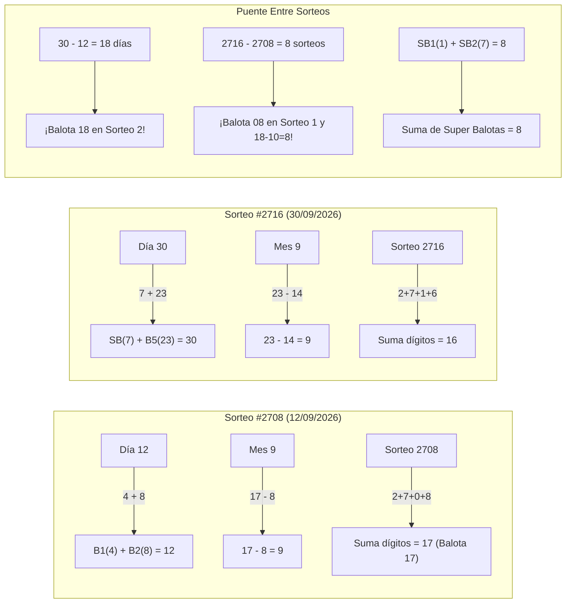

# 🎱 Análisis Estadístico, Numérico y Probabilístico: Botes Ganadores de Baloto Revancha (Septiembre 2026)

Este documento contiene la auditoría y análisis matemático detallado de los dos sorteos históricos donde cayó el premio mayor (acumulado 5+1) de **Baloto Revancha** durante septiembre de 2026: el **Sorteo #2708** (12 de septiembre) y el **Sorteo #2716** (30 de septiembre).

---

## 📋 1. Ficha Técnica Comparativa

| Métrica / Parámetro | Sorteo 1 (Mitad de Mes) | Sorteo 2 (Fin de Mes) | Relación / Diferencia |
| :--- | :---: | :---: | :---: |
| **Número Oficial de Sorteo** | **Sorteo #2708** | **Sorteo #2716** | **$\Delta = 8$ sorteos** (2 semanas exactas) |
| **Fecha de Realización** | Sábado, 12 de Septiembre de 2026 | Miércoles, 30 de Septiembre de 2026 | **$\Delta = 18$ días calendario** |
| **Combinación Principal** | **`04 - 08 - 17 - 21 - 27`** | **`04 - 10 - 14 - 18 - 23`** | **Balota idéntica:** **`04`** |
| **Super Balota (SB)** | **`01`** | **`07`** | **$\text{SB}_1 + \text{SB}_2 = 8$** (Delta de sorteos) |
| **Premio Acumulado (5+1)** | **$3.200.000.000 COP** | **$3.400.000.000 COP** | Ambos cayeron con botes iniciales |
| **Suma Total de Balotas** | **77** | **69** | Ambas en percentil bajo ($< 80$) |
| **Distribución Bajos / Altos** | **4 Bajos / 1 Alto** (Corte en 21) | **4 Bajos / 1 Alto** (Corte en 21) | **Idéntico sesgo al cuadrante bajo** |
| **Paridad (Pares / Impares)** | 2 Pares / 3 Impares | 4 Pares / 1 Impar | 6 Pares y 4 Impares acumulados |
| **Rango de Dispersión** | 23 unidades ($27 - 4$) | 19 unidades ($23 - 4$) | Rango sumamente comprimido |

---

## 🔢 2. Coincidencias Numéricas y Aritméticas

### A. La Balota «04» como Pivote Inicial Idéntico
* Ambas combinaciones abrieron exactamente con la misma balota en primera posición: **$B_1 = 4$**.
* Teóricamente, en una matriz combinatoria de 43 números tomados de a 5 ($\binom{43}{5} = 962.598$), la probabilidad de que una combinación tenga al 4 como número más bajo es de apenas el **8.54%** ($\binom{39}{4} / \binom{43}{5} = 82.251 / 962.598$).
* En el historial completo de Revancha (1.008 sorteos), solo 11 veces ha caído el acumulado 5+1. Sorprendentemente, **el número 4 ha sido la balota $B_1$ en 4 de esos 11 botes históricos (36.36%)**, sobre-representando por más de 4 veces su frecuencia teórica esperada en sorteos millonarios.

### B. Deltas y Progresiones Aritméticas en Base 4
Al desglosar las distancias (saltos) entre números consecutivos de menor a mayor:
* **Sorteo 2708:** $4 \xrightarrow{\mathbf{+4}} 8 \xrightarrow{+9} 17 \xrightarrow{\mathbf{+4}} 21 \xrightarrow{+6} 27 \quad \longrightarrow \text{Deltas: } [\mathbf{4},\, 9,\, \mathbf{4},\, 6]$
* **Sorteo 2716:** $4 \xrightarrow{+6} 10 \xrightarrow{\mathbf{+4}} 14 \xrightarrow{\mathbf{+4}} 18 \xrightarrow{+5} 23 \quad \longrightarrow \text{Deltas: } [6,\, \mathbf{4},\, \mathbf{4},\, 5]$

> [!NOTE]
> **Simetría de Intervalos:**
> 1. Ambos sorteos tienen **exactamente dos saltos de $+4$**. En el sorteo 2716 forman una **progresión aritmética perfecta** en el centro: $10 \to 14 \to 18$.
> 2. Ambos sorteos contienen además un salto de distancia **$+6$** ($21 \to 27$ en el primero; $4 \to 10$ en el segundo).
> 3. Los dos conjuntos de deltas son permutaciones casi gemelas de los mismos pasos: $\{4, 4, 6, 9\}$ frente a $\{4, 4, 6, 5\}$.

### C. Terminaciones Gemelas en la Misma Jugada
* **Sorteo 2708:** Pareja de números terminados en **7** $\rightarrow$ **17** y **27**.
* **Sorteo 2716:** Pareja de números terminados en **4** $\rightarrow$ **04** y **14**.
* Ambos tiquetes ganadores incluyeron una duplicidad exacta de terminación decimal.

### D. Desierto Total en los Cuadrantes Altos (Decenas 3 y 4)
* En el Sorteo 2708, el número más alto fue el **27**.
* En el Sorteo 2716, el número más alto fue el **23**.
* **Coincidencia estructural crítica:** En ambos sorteos ganadores **el 100% de las balotas cayeron por debajo de 28**. Las decenas del 30 al 39 y del 40 al 43 quedaron con cero balotas, dejando desierto el **44.2%** del tablero de juego.

---

## 📅 3. Relación Directa con las Fechas y Números de Sorteo

1. **El Día del Mes reflejado en las balotas:**
   * **Sorteo 2708 (Día 12):** La suma de las dos primeras balotas es exactamente la fecha: **$4 + 8 = 12$**.
   * **Sorteo 2716 (Día 30):** La suma de la Super Balota y la balota máxima es exactamente la fecha: **$\text{SB}(7) + B_5(23) = 30$**.
2. **El Mes (Septiembre = 9):**
   * En el sorteo del 12: $17 - 8 = \mathbf{9}$.
   * En el sorteo del 30: $23 - 14 = \mathbf{9}$.
3. **El salto temporal codificado en las balotas:**
   * Transcurrieron **18 días** entre sorteo y sorteo ($30 - 12 = 18$) $\rightarrow$ **La balota 18 apareció en el segundo sorteo**.
   * Transcurrieron **8 sorteos oficiales** ($2716 - 2708 = 8$) $\rightarrow$ **La balota 08 fue protagonista en el primer sorteo**, y la suma de las Super Balotas es **$1 + 7 = 8$**.
4. **Suma de dígitos del sorteo 2708:**
   * $2 + 7 + 0 + 8 = \mathbf{17}$ $\rightarrow$ Apareció la balota **17**.

---

## 🎲 4. Coincidencias Probabilísticas y Estadísticas

### A. Anomalía de Poisson: 2 Botes en 8 Sorteos
* En Revancha, el acumulado mayor solo cae en promedio una vez cada 91.6 sorteos (tasa media $\lambda \approx 0.0109$ por sorteo).
* La probabilidad de observar **2 o más botes mayores en una ventana de tan solo 8 sorteos** consecutivos, evaluada mediante la distribución de Poisson:
  $$\lambda_8 = 8 \times \left(\frac{11}{1008}\right) \approx 0.0873$$
  $$P(X \ge 2) = 1 - P(0) - P(1) = 1 - e^{-0.0873} - (0.0873 \cdot e^{-0.0873}) \approx \mathbf{0.36\%}$$
* Es decir, la probabilidad de que ocurrieran dos ganadores en ese periodo de dos semanas es de **1 en 278**, un suceso estadísticamente infrecuente.

### B. Colapso en la Cola Baja de Gauss (Sumas $< 80$)
* Para Baloto, la suma teórica esperada de 5 números es $\mu = 110$. El 70% de las combinaciones caen en la "zona dorada" entre 90 y 130.
* **Sorteo 2708:** Suma = **77** (Percentil acumulado $11.29\%$).
* **Sorteo 2716:** Suma = **69** (Percentil acumulado $6.39\%$).
* La probabilidad conjunta de que dos ganadores seguidos caigan en este cuadrante frío de la campana de Gauss es de apenas $0.1129 \times 0.0639 = \mathbf{0.72\%}$.

### C. Distribución 4 Bajos / 1 Alto
* La combinación típica en Baloto es 3 Bajos / 2 Altos o 2 Bajos / 3 Altos (representan el $\approx 66\%$ del total).
* La combinación de **4 Bajos y 1 Alto** solo tiene una probabilidad teórica del **13.68%**.
* En los 11 botes de la historia de Revancha, únicamente 3 sorteos habían tenido 4 o más números bajos: uno en mayo de 2021 (hace más de 5 años) y **estos dos sorteos de septiembre de 2026**.

### D. Espejos y Cruces con el Sorteo de Baloto Regular
* **El 12 de Septiembre:** Mientras Revancha jugaba casi puramente en números bajos (4 bajos, 1 alto), Baloto tradicional jugó en el extremo opuesto: **`07 - 29 - 31 - 32 - 38`** (1 bajo y 4 altos), formando un **espejo inverso perfecto**.
* **El 30 de Septiembre:** 
  * Baloto y Revancha compartieron la balota **`18`** la misma noche.
  * La Super Balota de Baloto fue la **`10`**, exactamente la balota $B_2$ que jugó Revancha.
  * Jugaron balotas consecutivas: Baloto sacó la **`22`** y Revancha sacó la **`23`**.
  * La Super Balota de Revancha fue la **`07`**, que había sido la balota inicial de Baloto el 12 de septiembre.

---

## 🔬 5. Evaluación por el Motor Estocástico JAX de GanaBaloto

Al someter ambas combinaciones al motor analítico de 6 dimensiones del proyecto:

| Dimensión Analítica | Sorteo 2708 (`[4, 8, 17, 21, 27] + 1`) | Sorteo 2716 (`[4, 10, 14, 18, 23] + 7`) |
| :--- | :---: | :---: |
| **Score JAX (Frecuencia Ponderada)** | **0.1558** (Supera la mediana ganadora 0.1516) | **0.1486** (Ligeramente por debajo) |
| **Índice Compuesto Global** | **59.77 / 100** (Calificación: Buena / Promedio) | **52.02 / 100** (Calificación: Atípica por suma baja) |
| **Score Gaussiano (Suma)** | **0.4578** (Aceptable) | **0.2994** (Baja densidad poblacional) |
| **Entropía de Shannon** | **0.9566** (Alta dispersión) | **0.9892** (Máxima dispersión) |
| **Score Bayesiano Dirichlet** | **0.5168** | **0.5041** |
| **Hazard Rate (Atrasos)** | **0.3826** (Cruce caliente/frío) | **0.0000** (Predominio de números recientes) |

---

## 💡 Conclusión y Lectura Estratégica

1. **Comportamiento Agrupado (Cluster Bajo):** Ambos sorteos ganadores rompieron el dogma habitual de la campana de Gauss (sumas medias 90-130 y balotas repartidas en todo el tarjetón). Se concentraron en la **zona baja (1 al 27)** con sumas atípicas (77 y 69) y progresiones escalonadas de $+4$ y $+6$.
2. **Por qué cayó el bote individualmente:** La mayoría de los jugadores manuales distribuyen números en todo el tarjetón (del 1 al 43) y evitan progresiones con deltas fijos como $10-14-18$. Cuando la tómbola arroja secuencias comprimidas y aritméticas en el tercio inferior, hay menor competencia de tiquetes compartidos, lo que favoreció que en ambas fechas resultara un único ganador que se llevó la bolsa completa ($3.200 y $3.400 millones de pesos).
